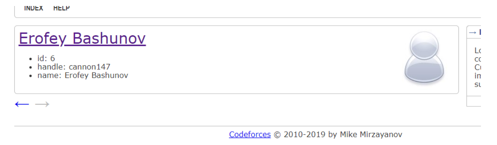
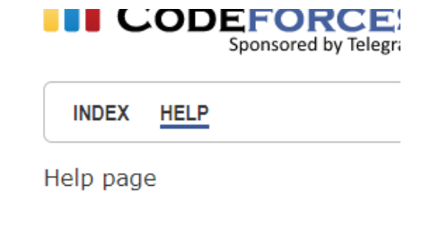
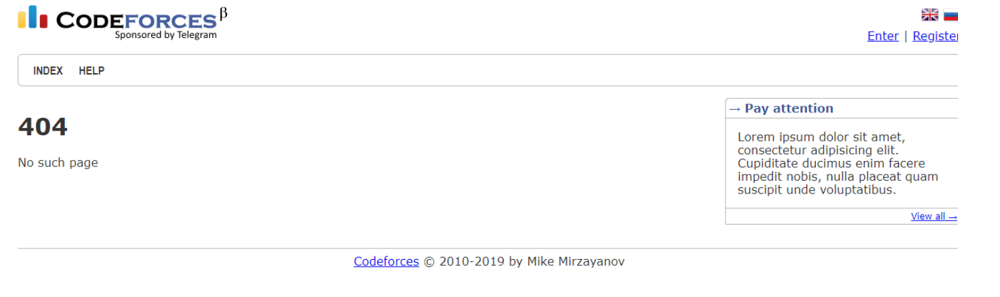

# HW4


## Общее

1. Откройте проект в IDEA как Maven-проект
2. Запустите в локальном Tomcat с корневым контекстом `/`
3. Убедитесь в работоспособности:
   - Должны отображаться страницы, похожие на Codeforces
   - На странице `/index` должен отображаться список пользователей
   - По клику на пользователя можно перейти на страницу пользователя
4. Внимательно прочитайте исходный код проекта


### Задача 1

***Задание:***
Улучшение страницы профиля пользователя `/user?handle=?`. Ожидаемый результат должен быть похож на:


***Требования:***
- Отображать одинаковую картинку для всех пользователей
- Реализовать функциональные стрелки для перехода к предыдущему/следующему пользователю по списку
- Если следующего/предыдущего пользователя не существует:
  - Стрелка должна становиться серой
  - Стрелка не должна быть кликабельной
- Поддержка альтернативного способа показа страницы: через параметр `user_id` в URL (`/user?user_id=3`). Ссылки на стрелках должны остаться по `handle`
- Модифицировать `FreemarkerServlet#getData`:
  - Если параметр заканчивается на `_id` и является корректным числом, он складывается в `data` как число типа `long`, а не как `string`

### Задача 2

***Задание:***
Подсветка текущего пункта меню. Ожидаемый результат:



***Требования:***
- Реализовать подчеркивание текущего пункта в меню. Продумайте, какие данные необходимо добавить в `data`
- Минимизировать дублирование кода в шаблонах вокруг элементов меню

### Задача 3

***Задание:***
Обеспечить редирект на страницу по умолчанию и написать корректную работу 404 ошибок.

***Требования:***
- Обеспечить редирект на `/index` при заходе:
  - На страницу без пути (по умолчанию)
  - На страницу `/`
- Обеспечить обработку 404-ошибок (страница не найдена):
  - Реализовать отображение 404-страницы. Ожидаемый результат: 
  - Убедиться, что возвращается корректный HTTP-статус 404
- Важно также изучить статус-коды ответов и понимать, какие их виды в каком случае используются 

### Задача 4

***Задание:***
Реализация объекта `Post` и реорганизация страниц
```
Post {
    id: long,
    title: String,
    text: String,
    user_id: long
}
```

***Требования:***
- Создайте тестовые объекты `Post` в `DataUtil` по аналогии с объектами `User`
- На главной странице отобразите список всех постов в обратном порядке (от последнего к первому). Рекомендуется использовать свою разметку из `HW2`
- При отображении поля `text` длиной более 350 символов обрезайте его, добавляя `...` в конце
- Перенесите страницу со списком пользователей на отдельный URL `/users`, добавте соответствующий пункт в меню. Для отображения таблицы используйте верстку из `HW2`

### Задача 5

***Задание:***
Улучшение сайдбара и создание страницы поста

***Требования:***
- В блоках сайдбара "Information" отображать тексты постов (также обрезать 350 символов)
- Заменить фразу `Information` на `Post #<post_id>` (с указанием `id` поста)
- Добавить переход по ссылке `View all` на страницу `/post?post_id=?`. На ней должен отображаться полноценный (не сокращенный) пост
- **!** используйте один общий макрос для отображения `post` на всех страницах (`/index` и `/post?post_id=?`). Макрос должен поддерживать как сокращенный способ записи, так и полный для корректного отображения на обеих страницах
- Добавить в профиль пользователя:
  - Количество его постов
  - Ссылку на страницу `/posts?user_id=?` со списком всех постов пользователя. Эта страница должна выглядеть как главная, использовать те же макросы, но отображать посты только данного пользователя

### Задача 6

***Задание:***
Добавление цветовых стилей для пользователей

***Требования:***
- Добавить пользователю свойство `color` типа `enum` со значениями: `RED`, `GREEN`, `BLUE`
- Модифицировать `userlink` для отображения окрашенного хэндла (как на Codeforces)
- Изменения в отображении пользователя:
  - Убрать подчеркивание имени
  - Изменить шрифт имени
  - Добавить цвет хэндля в зависимости от значения `color`
  - Сохранить старый режим отображения через параметр `nameOnly`
- Использовать старый режим для отображения текущего пользователя в шапке страницы. Напоминание: аутентификация осуществляется через параметр `?logged_user_id=`
- Во всех остальных местах использовать новый стиль отображения